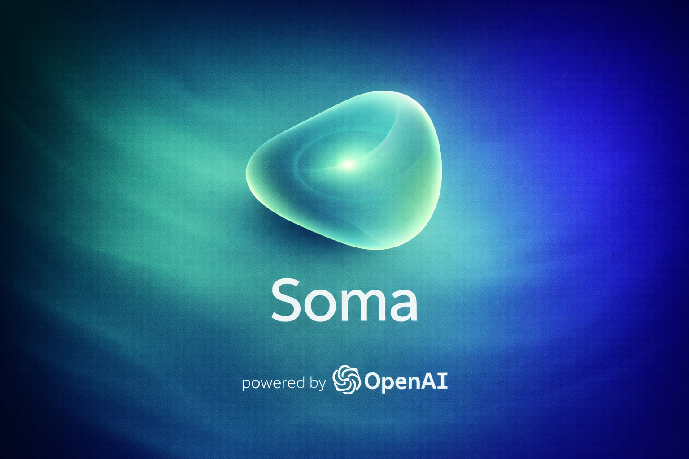

<p align="center">
  
</p>

# Soma

Soma — ранний open-source Telegram-first проект на Node.js + TypeScript с **safety-first** и **policy-first** контрактом.

Проект развивается консервативно: без hype, без имитации клинической помощи и без обещаний функциональности, которой нет в коде.

## Текущий stage

**Stage 0 / Public Beta Kernel** — рабочий baseline с проверяемыми safety-инвариантами и ограниченным продуктовым scope.

## Что уже реализовано

- polling-based Telegram transport (`telegraf`);
- access gate (`ACCESS_MODE=open|allowlist`, allowlist через `TELEGRAM_ALLOWED_USER_IDS`);
- normalize входящего текста;
- policy-first safety слой с детерминированной классификацией;
- orchestrator: `policy -> quota -> conversation`;
- SQLite persistence (`users`, `daily_usage`);
- free-tier суточный лимит сообщений;
- команды `/start`, `/help`, `/limits`;
- regression suite для safety/policy и env/config.

## Чего в проекте пока нет

- webhook/deployment инфраструктуры;
- продвинутого продуктового conversation layer;
- LLM-интеграций и внешних AI API;
- медицинской/клинической или кризисной функциональности.

## Product boundaries

Soma на текущем этапе:

- не медицинский и не психотерапевтический сервис;
- не кризисная линия помощи;
- не делает диагностику и не назначает лечение;
- не допускает direct-path в user-facing ответы в обход policy слоя.

## Runtime flow

```text
Telegram text input
-> access gate
-> normalize
-> orchestrator
   -> safety policy
   -> if blocked: policy reply
   -> if allowed: usage/quota check
   -> if quota ok: conversation service + usage increment
-> user reply
```

## Storage и quota

SQLite schema (`src/storage/schema.sql`):
- `users` (`user_id`, `plan`, `created_at`, `updated_at`)
- `daily_usage` (`user_id`, `date_key`, `message_count`)

Quota baseline:
- план по умолчанию: `free`;
- лимит задается `FREE_DAILY_MESSAGE_LIMIT`;
- ключ учета: `user_id + date_key (UTC YYYY-MM-DD)`.

## Быстрый старт

```bash
npm install
cp .env.example .env
npm run dev
```

Минимально обязательные env:
- `TELEGRAM_BOT_TOKEN`
- `DATABASE_PATH`

## Команды

```bash
npm run dev
npm run lint
npm run test
npm run build
npm run check
```

## Документация

- [Docs index](./docs/README.md)
- [Vision](./docs/vision.md)
- [Roadmap](./docs/roadmap.md)
- [Product principles](./docs/product-principles.md)
- [Safety boundaries](./docs/safety.md)

### Техническая документация

- [Docs index](./docs/README.md)
- [Architecture](./docs/architecture.md)
- [Development](./docs/development.md)

## Community и governance

- [CONTRIBUTING.md](./CONTRIBUTING.md)
- [SECURITY.md](./SECURITY.md)
- [CODE_OF_CONDUCT.md](./CODE_OF_CONDUCT.md)
- [LICENSE (MIT)](./LICENSE)

## Решение по `package.json#private`

`"private": true` оставлено осознанно, чтобы исключить случайную публикацию этого application baseline в npm.
